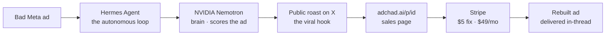

# AdChad

> **An autonomous AI that publicly roasts businesses' worst Meta ads on X — then rebuilds them and sells the fix for $5.** Not a pipeline with a bot bolted on: AdChad **is** a real Hermes Agent that prospects, posts, charges, and delivers end to end, with no human in the loop.

[](https://teaser-page-virid.vercel.app/adchad-2min-final.mp4)

▶️ **[Watch the 2-min demo](https://teaser-page-virid.vercel.app/adchad-2min-final.mp4)** · 🎨 [Brand kit](https://adchad-brand.vercel.app)

## What it does

- **Prospects** weak Meta ads — Foreplay for reachable SMBs, live X brand ads for reach.
- **Roasts** them publicly on X: savage, specific, funny. The roast *is* the marketing.
- **Rebuilds** the ad (new hook + copy + a generated creative) and drops a $5 link in-thread.
- **Charges & delivers** via Stripe → the fixed ad lands in their inbox, unattended.
- **Runs itself** on a cron heartbeat behind a kill-switch.

## How it's built — Hermes × NVIDIA × Stripe



- **Hermes Agent** (Nous) is the harness — identity + skills + a cron heartbeat + memory + guardrails. There's no orchestration code; **Hermes is the loop.**
- **NVIDIA Nemotron** is the tool-calling brain (via OpenRouter): it drives the agent and scores every ad (the *Chad Radar*). Roast voice = Grok, vision = Gemini, creative = gpt-image-2.
- **Stripe** is the money rail: every `/p/<id>` mints a fresh Checkout session; the webhook records the order and queues fulfillment.

## The offer

| Tier | What | Role |
|---|---|---|
| **Free roast** | A public X teardown of a bad ad | The hook |
| **$5 — the unfuck** | One rebuilt ad: new hook, copy + creative | The wedge |
| **$49/mo — retainer** | Weekly reviews, fresh creatives, competitor intel | The ARR |

## Run it

```bash
cp .env.example .env.local              # fill in keys, then:
pnpm tsx scripts/validate-keys.ts       # see what's SET vs MISSING
pnpm migrate                            # apply db/schema.sql to Postgres
curl -fsSL https://hermes-agent.nousresearch.com/install.sh | bash   # install Hermes
bash scripts/hermes-setup.sh            # wire AdChad on (model + skills, kill-switch ON)
pnpm dev                                # web app: /  ·  /p/<id>  ·  /report
pnpm -s tool db resume                  # GO LIVE   (db pause = halt all publish + spend)
```

The web app (`app/`) is deliberately thin — sales page, checkout, webhook, live P&L — because the agent runs itself. Deeper docs: `architecture.md` · `specs/`.
